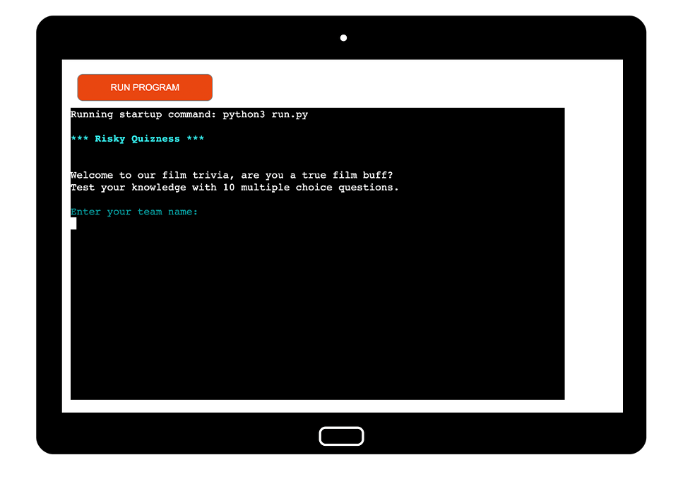
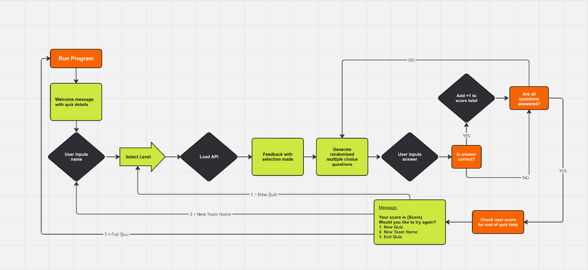
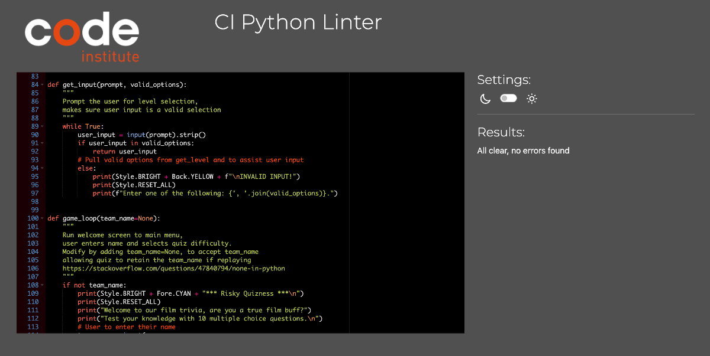
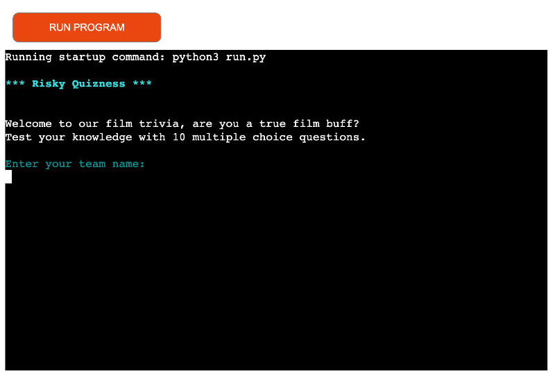

# Risky Quizness

It all started with a pub quiz night, it was loud and the screens were small. Our team couldn't see the quiz questions given the position of our table and often we missed out on hearing the questions correctly. When it came to marking our pen and paper game sheets, we relied on opposing teams to accuratley check our answers with what the quiz master had shouted out and hoped we had scored enough points to win a prize at the end of the night. It got me thinking about how I would improve this experience to make it easier for the players within each team while enjoying the pub atmosphere.

This app has been developed as a prototype for a company called Risky Quizness, who host pub quiz games and are looking to go digital with their game nights. The idea is to allow each team to independently keep track of their questions, answers and score tally as the night progresses, and in turn streamlining the final score system for team competition progression and end of night prizes. With this prototype, Risky Quizness will be able to rotate their quiz questions automatically by fetching randomised themed questions for each round played. 

Live Link: https://risky-quizness-c9032af3d3e3.herokuapp.com/

## Game Scope

### Overview

- The prototype app is based on film trivia with all questions fetched from the API related to the film industry theme.
- Each team has to complete answering 10 multiple choice questions, with each question immediately validated.
- As the teams progress through the quiestions and levels, their points / score is kept track of. 
- When teams have completed answering all questions their final score is presented to them.
- Players then have the option to continue playing, play as a new team or finish their quiz journey.

### How to play

- Each team is welcomed to the main screen where they are promted to enter their team name.
- After their name has been added to the system, they are asked to select their difficulty level based on their theme knowledge.
  - Difficulty levels are presented as 1 = Easy, 2 = Medium and 3 = Hard.
  - Players to input numbers 1,2 or 3 based on their decision on level to procceed with.
- The players will then start with answering Question 1 fetched from selected level chosen.
  - They will be presented with 4 possible answers to choose from in a multiple choice form.
  - Players will then input an option 1, 2, 3 or 4.
- When teams have answered their question, their choice is immediately validated as correct or incorrect.
  - If correct, a +1 counter is added to the teams score for end of game tally.
- Players need to answer all 10 questions to reach the end of the quiz.
- After Question 10 has been answered, the team score total is presented out of 10.
- Players then have the option to either:
  - 1 = Play again: This allows the players to keep their team name and choose a new difficulty level
  - 2 = New Team: Allows a new team to take over and test their knowledge
  - 3 = Exit: Let's teams finish their round and exit their game play.

### Features

__Existing features:__
- Teams are able to add their names for personalised feedback during quiz.
- Based on players knowledge, they are able to select a difficulty level.
  - Levels are easy, medium and hard which are pulled directly from a loaded API for each difficulty within the theme.
- Questions asked are fetched from a loaded API that has 40 questions within the libabry.
  - Random shuffle function added to allow for a fresh set of 10 questions with each round played.
  - This helps with replayability of quiz.
- Keep track of questions and answers as players progress.
  - If correct, the players are given a message "Correct {team_name}!"
  - If incorrect, the players are presented with the correct answer "Oops! The correct answer is: {correct_answer}"
- After each round of 10 questions the team is presented with their total score tally out of 10.
  - While players answer each question, a +1 counter is added to towards their final total.
- Players are given feedback based on their final score average.
  - If score is less than 5, "Better luck next time! Not quite the film buff just yet."
  - If score between 5 and 7 "Not bad, you could brush up on your film knowledge."
  - If score greater than and equal to 8, "Right down to Quizness... you're a true film buff!"

__Future Features__
- Adding more trivia theme options, allowing players to choose their prefered trivia theme nights.
- Build and continuously update a database of questions to keep up to date with themes.
- Round progression with levelling up of theme difficulty.
- Link a database that stores and updates automatically as all team names and scores are collected per pub quiz attended.
  - With this Risky Quizness can gather informatioon of their top teams around the various pubs.
    - Hold an ultimate quiz battle with top teams competing to take the top spot within their area.
- Create another version of the app that allows users to host their own at home trivia nights.
  - Downloadable app to smart devices that will:
    - include a quiz master platform for the host to manage teams and gamplay
    - players arena where teams have access similar to the prototyp platform to interact and answer questions.
    - include mini quiz games for single players on the move to brush up on their quiz theme knowledge.
- Bring in a few animated screens between rounds and questions for interactive fun during quiz game game play.

## Solution Model

### Flowchart

## Technologies Used

### Languages

- HTML5
- CSS3
- Python

### Other Sites

- Quiz Trivia API:
  - Within this platform, it allowed me to generate specific API links according to trivia theme and difficulty.
    - Open Trivia Database: https://opentdb.com/

- Assisted problem solving sites:
  - Python API Tutorial: https://www.dataquest.io/blog/python-api-tutorial/
  - Converting the characters in strings to HTML: https://stackoverflow.com/questions/2087370/decode-html-entities-in-python-string
  - Random shuffle of answers: https://www.geeksforgeeks.org/random-shuffle-function-in-python/
  - Retain team_name: https://stackoverflow.com/questions/47840794/none-in-python

## Testing 

| TEST INPUT | CORRECT OUTCOME | MEET REQUIREMENTS |
|:---:|:---:|:---:|
| Load welcome message | Main page loads correctly | PASS |
| Input team name | User input is returned as Title Case & trailing whitespaces removed | PASS |
| Input difficulty option | User can only input 1, 2, or 3 & trailing whitespaces removed. INVALID INPUT! is prompted & user is asked to input again | PASS |
| Load question 1 | After difficulty level selected, user is prompted question 1 | PASS |
| Answer input validation | User can only input 1, 2, 3 or 4 & trailing whitespaces removed. INVALID INPUT! is prompted & user is asked to input again | PASS |
| Correct answer feedback | Correctly input answer prompts bold & adds +1 counter to score for final total | PASS |
| Incorrect answer feedback | Incorrectly input answer prompts what the correct answer actually is & does not add any counters to final score | PASS |
| Quiz questions shuffle | Quiz questions shuffle & rotate the 40 API questions, fetching a new set of questions for each new quiz round played | PASS |
| Correct answer display randomised | Multiple choice answers fetched from API are displayed randomised for each new question | PASS |
| Score validation | After all 10 questions have been answered, the team score is presented with feedback message based on success rate | PASS |
| End of quiz menu | User can only input 1, 2 or 3 & trailing whitespaces removed. INVALID INPUT! is prompted & user is asked to input again | PASS |
| New Quiz prompt | Retains team name & returns user to select a new difficulty level. User can only input 1, 2 or 3 & trailing whitespaces removed. INVALID INPUT! is prompted & user is asked to input again | PASS |
| New Team prompt | Returns user to welcome message & input a new team name. User can only input 1, 2 or 3 & trailing whitespaces removed. INVALID INPUT! is prompted & user is asked to input again | PASS |
| Exit prompt | User is exited from app with goodbye feedback to confirm. User can only input 1, 2 or 3 & trailing whitespaces removed. INVALID INPUT! is prompted & user is asked to input again | PASS |

### Validator Testing 

- Passed the code through CI PEP8 Python Validator, there were very few errors present, all were quick fixes.
  - E501 line too long >79 characters:
    - The API URLs were split into multiple lines using parentheses around the strings
    - A few print statements needed shortening and refining of characters
    - No other lines exceed 79 characters, complying with the PEP 8 guidelines
  - W293 blank line contains whitespace:
    - Removed space within the blank line section in 108, complying with the PEP 8 guidelines

  - After fixing above attributes, no errors were found when running the code through [CI PEP8 Python Validator](https://pep8ci.herokuapp.com/)

### Bugs Encountered

- HTML fetched from the quiz question & answers API returns as unicode type:
  - adding 'html.unescape()' cleans API HTML fetched and makes it more readable.

- During initial deployment 'ModuleNotFoundError' blocked app from running:
  - requests import was not updating requirements.txt when running to the terminal
  - numerous trial & errors with adding requests import and running pip3 freeze > requirements.txt to terminal
  - by manually adding 'requests==2.32.2' to requirements.txt file, it assisted Heroku with recognising the library and successfully deployed app for first phase of testing.

- After adding colorama import, another 'ModuleNotFoundError' presented after deployment:
  - pip3 install colorama stated 'Requirements satisfied' when running to the terminal
  - after pushing a few solutions I realised the requirements.txt file was not updating as it should
  - by runinning pip list to terminal I was able to see what packages were installed:
    - 'pip install requests==2.32.2' to reload before runung 'pip3 freeze --local > requirements.txt' to terminal
  - ran pip list to terminal again and both packages were now successfully installed
  - Deployed newly pushed updated requirements, and app loaded successfully with colourama functioning

### Unfixed Bugs

- No unfixed bugs, app running with no errors.

## Deployment

### Heroku
- The site was deployed to Heroku as follows:
  - Log into Heroku or create an account if you don't already have one
  - Click 'New' from the top right of the screen
  - Select 'Create new app'
  - Enter a unique application name - select appropriate region
  - Click 'Create app'
  - One the following page, click the 'Settings' tab and scroll to Config Vars
  - In the KEY input field, enter 'PORT' and in the VALUE input field, enter '8000'
  - Click 'Add'
  - On the same page, scroll down to buildpacks and add two buildpacks
  - The ordering for these is heroku/python followed by heroku/nodejs
  - At the top of the page, click 'Deploy'
  - Select Github as the deployment method
  - Search for and select correct repository and click 'Connect'
  - At the bottom of the same page, select either Automatic Deployment or Manual Deployment
  - Wait for your site to be deployed
- The site was deployed to Heroku, the live link can be found here: https://risky-quizness-c9032af3d3e3.herokuapp.com/

### Cloning of the Repository Code locally
- The terminal function and template for the deployable application was provided by Code Institute
  - Go to the Github repository that you want to clone
  - Click on the Code button located above all the project files
  - Click on HTTPS and copy the repository link
  - Open the IDE of your choice and paste the copied git url into the IDE terminal
  - The project is now created as a local clone

### Version Control
- The quiz was created using Gitpod editor and pushed to Github to the remote repository 'RiskyQuizness'
- Git commands were used throughout the development to push the code to the remote repository
- The following git commands were used:
  - git add . - to add the files to the staging area before being committed
  - git commit -m "commit message" - to commit changes to the local repository queue that are ready for the final step
  - git push - to push all committed code to the remote repository on Github
  - pip3 install imports for python library loads

## Credits 

- Slack channel peers for their feedback with questions and taking the time to look at Risky Quizness with fresh eyes
- My mentor for the support and knowledge shared to keeping prototype simple and clean
- Tutor Assist for the support with getting Heroku and Github version to communicate with app deployment